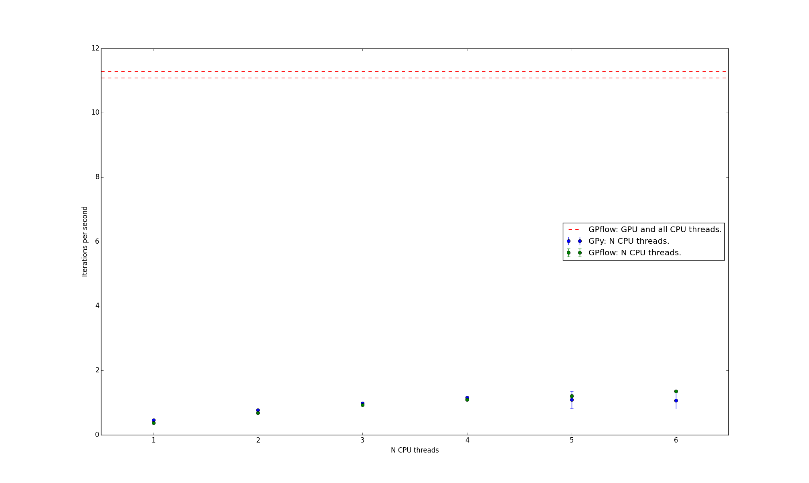

# GPflow_profiling
This repository gives the code used to profile [GPflow](http://github.com/GPflow/GPflow) in the paper: "GPflow: A Gaussian process library using TensorFlow", by Matthews et al 2016.

Functionally, the algorithms are nearly identical in GPflow and GPy. In both cases we used the AdaDelta optimizer. The optimizer implementations required us to recalibrate the step sizes. Running the two implementations for the same number of cycles we obtained accuracies within 0.1% of one another, despite the stochasticity of the algorithm. The minibatch size and number of inducing points were the same in both implementations and were unchanged from Hensman et al, MCMC for variationally Sparse Gaussian Processes, NIPS 2015.

GPy was set up as follows. We used the recent stable release v1.4.1. For the multiclass likelihood we used our own Cython implementation, which we heavily optimized for a previous paper. We confirmed that we were using the Intel Math Kernel Library optimizations of numeric Python, that are released with the popular Anaconda Python bundle.

We now detail our GPflow settings. We use GPflow branch profiling_mods_paper, which was taken from the master branch and modified to allow us to manipulate the number of TensorFlow threads. We used float32 as the main real valued data type.

The exact build of TensorFlow was taken from this merged [pull request](https://github.com/tensorflow/tensorflow/pull/5010) to TensorFlow master by [Tom Nickson](https://uk.linkedin.com/in/thomas-nickson-a67a8628), one of the GPflow contributors. The exact TensorFlow Python package can be found [here](http://mlg.eng.cam.ac.uk/matthews/GPflow_profiling/tensorflow-0.11.0rc0-py3-none-any.whl)

We used CUDA 7.5 and no avx.  We note that even faster results can be obtained for GPflow by compiling under avx. 

